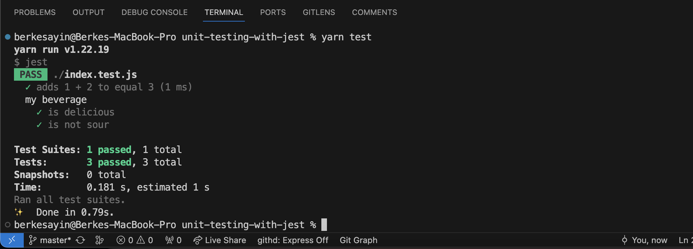
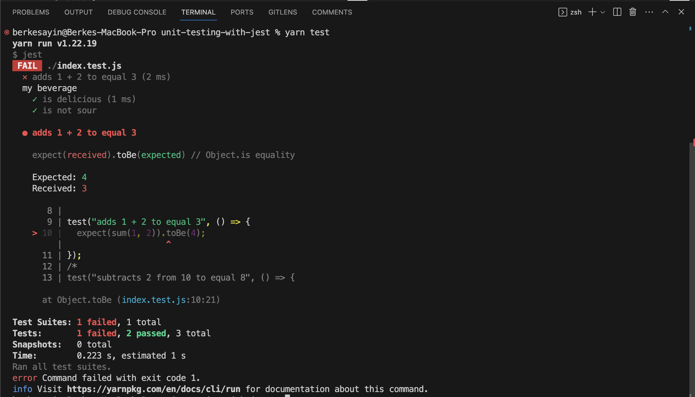
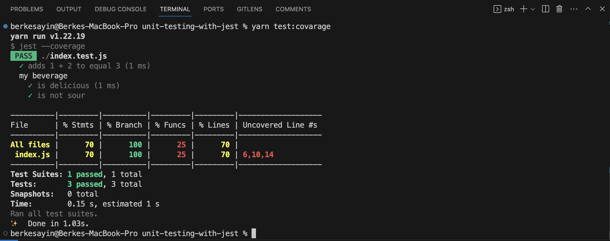

# Unit Testing With Jest

### Contents
* [What Is Jest?](#jest)
* [Getting Started With Jest](#get-started)
* [Create Functions](#functions)
* [Test Functions](#test-functions)
* [Test Covarage](#test-covarage)

> **Jest:** Jest is a delightful JavaScript Testing Framework with a focus on simplicity.

### What Is Jest? <a name="jest"></a>

- Jest is a popular JavaScript testing framework that is commonly used for testing JavaScript and TypeScript applications. 
- It is an open-source testing framework developed by Facebook and is primarily designed for testing JavaScript code in web applications, including front-end and back-end code.

### Getting Started With Jest <a name="get-started"></a>

1. Create an empty project, and add index.js file,
2. Create package.json,

```bash
npm init
```

##### package.json

```js
{
  "name": "unit-testing-with-jest",
  "version": "1.0.0",
  "description": "Unit Testing",
  "main": "index.js",
  "scripts": {
    "test": "echo \"Error: no test specified\" && exit 1"
  },
  "author": "Berke Sayin",
  "license": "ISC"
}

```

3. Install Jest using your favorite package manager:

```bash
yarn add --dev jest
```

- This command is used to add the Jest testing framework as a development dependency to the project using the Yarn package manager.

4. Update ``scripts`` at ``package.json``:

```js
{
  "name": "unit-testing-with-jest",
  "version": "1.0.0",
  "description": "Unit Testing",
  "main": "index.js",
  "scripts": {
    "test": "jest",
    "test:covarage": "jest --coverage",
    "test:watch": "jest --watch"

  },
  "author": "Berke Sayin",
  "license": "ISC",
  "devDependencies": {
    "jest": "^29.7.0"
  }
}
```

After these scripts, run these commands when needed: 

- ``yarn test`` for ``yarn jest`` : This command runs your Jest test suite. It executes all the test files that match the default pattern (usually files ending with .test.js or .spec.js) in your project. It provides test results in your terminal, showing which tests passed or failed.   

<br>

- ``yarn test:covarage`` for ``yarn jest --coverage``: This command runs your Jest test suite and also generates a code coverage report. Code coverage measures which parts of your code are covered by your tests. After running this command, you'll typically find a coverage report in your project's directory. It shows which lines, functions, and branches of your code are covered by tests and which are not. This is useful for identifying untested or poorly tested code.

<br>

- ``yarn test:watch`` for ``yarn jest --watch``: This command runs Jest in watch mode. Watch mode is a development tool that automatically re-runs your tests whenever you make changes to your code or test files. It's a great way to get immediate feedback on how your changes affect your tests. Jest watches for file changes and reruns relevant tests, making the development and debugging process more efficient.

### Create Functions <a name="functions"></a>

1. Go to index.js file,
2. Create some functions or objects and export them to use at the test file.

##### index.js

```js
const sum = (a, b) => {
  return a + b;
};

const myBeverage = {
  delicious: true,
  sour: false,
};

module.exports = {
  sum,
  myBeverage,
};
```

### Test Functions <a name="test-functions"></a>

1. Create index.test.js file, go there,
2. Import functions at index.js,
3. Test the functions and objects.

##### index.test.js

```js
const {
  sum,
  myBeverage,
} = require("./index.js");

test("adds 1 + 2 to equal 3", () => {
  expect(sum(1, 2)).toBe(3);
});

// This test used expect and toBe to test that two values were exactly identical.

describe("my beverage", () => {
  test("is delicious", () => {
    expect(myBeverage.delicious).toBeTruthy();
  });

  test("is not sour", () => {
    expect(myBeverage.sour).toBeFalsy();
  });
});
```
##### Test Results 

- Tests: 3 passed, 3 total 



- Tests: 1 failed, 2 passed, 3 total 


### Test Covarage <a name="test-covarage"></a>

- Jest can generate code coverage reports to help you identify which parts of your code are covered by tests and which are not. This is valuable for ensuring comprehensive test coverage.

``yarn test:covarage`` or ``yarn jest --coverage``



##### Test (Code) Covarage

- File 
- Statements
- Branch
- Functions
- Lines
- Uncovered Line

##### Following Test (Code) Covarage Result From Browser